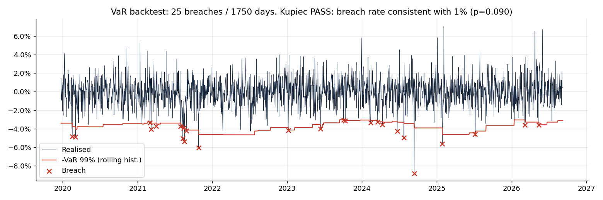
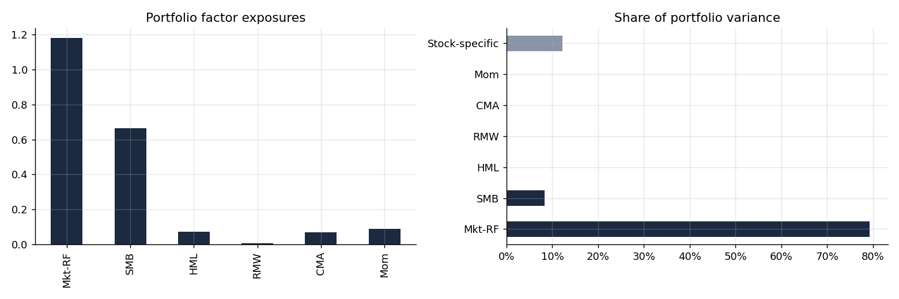
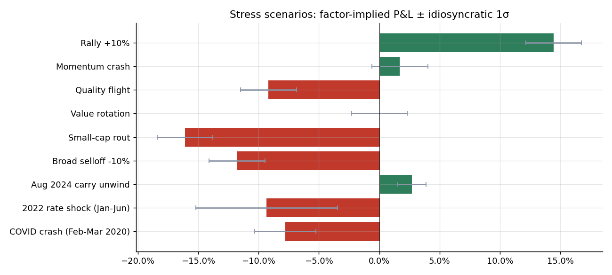

# Portfolio Risk Engine

Factor decomposition, tail risk, stress testing, liquidity and portfolio construction for a long-only US small/mid-cap equity book. Python, with a CLI, a [live dashboard](https://portfolio-risk-engine-daniel-shenouda.streamlit.app/), and a [walkthrough notebook](notebooks/analysis.ipynb). Runs offline on synthetic data.

Essential Question: *what does this portfolio actually own, and how much can it lose?*

I'm a freshman at BU studying Applied Math. I built this because I wanted to know what actually drives risk in a small/mid-cap long-only book, and reading about it wasn't getting me there. So I built the tooling and looked.

Most of the answer turned out to be two numbers. On a 20-name small/mid-cap book, market beta and size exposure account for 91% of the variance, which means diversifying across twenty names buys less than it looks like it does. The part I didn't expect was how much of the work is checking whether your own model is lying to you.

## The main result: my VaR model fails its own backtest

A 99% one-day VaR should be breached about 1% of the time. Run on the example portfolio over 1,905 trading days, this one was breached 30 times where 19 were expected. Kupiec's proportion-of-failures test rejects at p = 0.020.



The second test says something more specific. Christoffersen's independence test *passes* (p = 0.090), so the breaches are not clustered — they don't all arrive in one bad month. The model isn't merely slow to react to a volatility spike; it is systematically too optimistic across the whole sample. A trailing 250-day window on a 26.5%-vol book simply doesn't contain enough tail to forecast the tail.

This is the finding I'd have missed if I'd only built the model and not tested it. It's also what motivates the GARCH-filtered VaR on the roadmap below.

## What else the example portfolio shows



**It behaves like a leveraged small-cap index.** Market beta 1.09, SMB loading 0.92. Those two factors are 91% of variance; HML, RMW, CMA and momentum together contribute under 1%. Twenty separate tickers, two real bets.

**The size tilt is what makes the crash scenarios severe.** Replaying Feb–Mar 2020 factor returns through current exposures gives −42.4%, against −19.0% for the Dec 2018 selloff and −27.7% for the 2022 rate shock.



**Normality understates the tail by 14%.** One-day 99% CVaR is 4.56% under a fitted Student-t (ν = 8.9) versus 4.01% under a Gaussian.

**Risk parity would be a free improvement.** Equal risk contribution on the same twenty names runs at 20.7% annualised vol against 23.3% today, and lifts the effective number of independent bets from 17.1 to a full 20.

**Two things I expected to matter and didn't.** Sector factors cut mean absolute residual correlation only from 0.050 to 0.040 — a real improvement but far smaller than on synthetic data, because twenty names across six sectors leaves 2–4 stocks per sector and the sector factor is noisy. And liquidity doesn't bind at all at student-fund scale: capacity is roughly $799M before the least liquid name needs more than five days to exit. Worth knowing where the constraint *is*, even when it's nowhere near you.

<details>
<summary>Full output of <code>python cli.py examples/portfolio.csv</code></summary>

```
1. Annualised volatility is 26.5%: 89% systematic (factor) risk, 11% stock-specific.
2. The largest single risk driver is Mkt-RF (71% of total variance). Portfolio beta to the market is 1.09, SMB exposure +0.92.
3. AXON alone contributes 1.0% of total variance through stock-specific risk; the top 3 names account for 2.7%.
4. 1-day 99% CVaR is 4.56% under a fat-tailed (Student-t, ν=8.9) model vs 4.01% assuming normality. Normal assumption understates tail loss by 14%.
5. Rolling historical VaR backtest: 30 breaches in 1905 days (expected 19.1). Kupiec: REJECT: too many breaches (p=0.020). Christoffersen: PASS: no evidence of breach clustering (p=0.090).
6. Worst stress scenario is 'COVID crash (Feb-Mar 2020)' at -42.4% factor-implied P&L.
7. Effective number of independent bets: 17.1 (out of 20 holdings). A risk-parity allocation on the same names would run at 20.7% vol vs 23.3% currently.
8. Adding sector factors cut mean |residual correlation| from 0.050 to 0.040: the Fama-French factors alone were missing a common sector driver.
9. Rolling 1y market beta has ranged 0.94 to 1.16 (now 1.12); exposures are not static.
10. Liquidity at $1.1M AUM and 20% of ADV: weighted exit is 1.0 days, slowest name AXON at 1.0 days; liquidity-adjusted 99% VaR 3.58% vs 3.57%. Capacity: ATKR becomes a 5-day exit at $798.7M AUM.
```

</details>

## Quick start

```bash
pip install -r requirements.txt

# Offline demo on synthetic data (no network needed)
python cli.py --synthetic

# Real portfolio: CSV with ticker,weight columns
python cli.py examples/portfolio.csv --start 2018-01-01

# Dashboard
streamlit run app.py

# Tests
pytest
```

The first live run downloads prices (yfinance) and Fama-French factors (Ken French data library) and caches them in `data_cache/`; subsequent runs are instant.

`examples/portfolio.csv` is an illustrative equal-ish weighted basket of twenty US small/mid-caps ($500M–$5B), not anyone's actual holdings. Swap in your own `ticker,weight,sector` file to analyse a real book.

## What it computes

**Factor risk model** (`riskengine/factors.py`)
Each holding's daily excess return is regressed on the Fama-French 5 factors plus momentum. Portfolio variance is then decomposed as

    Var(r_p) = w'(B Σ_F B' + D)w = factor variance + idiosyncratic variance

with per-factor attribution via marginal contributions (x_k · (Σ_F x)_k, where x = B'w), which sum exactly to total factor variance. Output: "the book is 1.14 beta, 81% of variance is market, SMB is the second driver, and one name contributes 3% of variance on its own." The module also reports mean absolute residual correlation as a diagnostic for missing factors.

**Tail risk** (`riskengine/tail.py`)
One-day VaR and CVaR at a chosen confidence level, estimated four ways and compared:

| Method | Assumption | Why include it |
|---|---|---|
| Historical | none | baseline; only knows about losses that already happened |
| Parametric | Gaussian | what most people compute; understates tails |
| Monte Carlo (Normal) | Gaussian, full covariance | isolates the effect of the distribution choice |
| Monte Carlo (Student-t) | fat tails, full covariance | closer to how equities actually behave |

Degrees of freedom for the t-distribution are fitted from pooled standardised returns. The gap between the t and Gaussian CVaR is reported as "how much a normal assumption understates tail loss."

**VaR backtesting**
Rolling out-of-sample VaR: each day's estimate uses only the preceding window. Breaches are counted and tested two ways. Kupiec's proportion-of-failures test (LR, χ²(1)) asks whether the breach *count* matches the target rate. Christoffersen's independence test fits a first-order Markov chain to the breach indicator and asks whether breaches *cluster*; a model that ignores volatility regimes can pass Kupiec and fail this.

**Sector factor** (`fit_factor_model(..., sectors=...)`)
The factor model assumes residuals are uncorrelated across stocks. To test that, equal-weighted sector returns (orthogonalised to the market) are added as extra factors and the mean absolute residual correlation is compared with and without them. With only a few names per sector, each stock's own regression uses a leave-one-out sector factor; otherwise the stock is regressed on an average containing itself and the residual correlations become spuriously negative.

**Rolling exposures** (`rolling_betas`)
Portfolio betas re-estimated on a 1-year rolling window with current weights, so exposure drift is visible rather than assumed away.

**Liquidity-adjusted VaR** (`liquidity_adjusted_var`)
Days to liquidate each position at a participation cap on average daily dollar volume; market VaR scaled by √(weighted horizon) plus a square-root-law impact cost. Also reports **capacity**: the AUM at which the least liquid name becomes a 5-day exit. For a $1M book in $500M+ names liquidity is not binding; the point is to know the AUM at which it starts to be.

**Stress testing** (`riskengine/stress.py`)
Historical replay pushes realised factor returns from named windows (GFC, COVID crash, 2022 rate shock, Aug 2024 unwind, …) through the portfolio's *current* exposures. Hypothetical shocks ("small-cap rout", "momentum crash") are specified directly as factor moves. Both report factor-implied P&L with an idiosyncratic ±1σ band so the user knows how much stock-specific noise could sit on top.

**Portfolio construction** (`riskengine/optimize.py`)
Ledoit-Wolf (2004) shrinkage of the covariance matrix toward scaled identity, implemented from the closed-form optimal intensity. On top of that: minimum variance, equal risk contribution (risk parity), and maximum diversification optimisers, all long-only with position (and optional sector) caps. Risk contributions and the effective number of bets (1/ΣRC²) are computed for the current book and each alternative.

## Repository layout

```
riskengine/
  data.py       prices, volume, sectors, factor downloads, caching, synthetic market
  factors.py    factor regressions, sector factors, variance decomposition, rolling betas
  tail.py       VaR/CVaR estimators, Monte Carlo, Kupiec + Christoffersen, liquidity VaR
  stress.py     historical replay and hypothetical shocks
  optimize.py   Ledoit-Wolf, risk contributions, optimisers
  report.py     orchestration + plain-English findings
app.py          Streamlit dashboard (7 tabs)
cli.py          command-line runner
notebooks/      end-to-end walkthrough with commentary
tests/          17 tests: beta recovery, decomposition identities, Kupiec/Christoffersen,
                sector-factor effect, optimiser constraints, liquidity scaling
examples/       sample small/mid-cap portfolio (ticker, weight, sector)
scripts_make_figures.py   regenerates docs/ images
```

## Design choices worth knowing

- **Synthetic data is first-class.** `synthetic_market()` generates returns from a known 6-factor model with Student-t noise and an embedded crash. Tests check the engine recovers the true betas (corr > 0.95), which is the only way to verify the estimation code is right rather than merely running.
- **Sign convention:** all VaR/CVaR numbers are positive losses as a fraction of portfolio value.
- **Residual independence is checked, not assumed.** If residual correlation is high, the idiosyncratic component is understated and a sector factor should be added.
- **Shrinkage over sample covariance.** With N names and T days the sample matrix has N(N+1)/2 free parameters; optimisers on it chase noise. Shrinkage intensity δ is reported so you can see how much the data is being trusted.

## Limitations

- The rolling historical VaR is miscalibrated on this book (Kupiec p = 0.020) — documented above rather than hidden, and the reason GARCH filtering is first on the roadmap.
- Factor model is linear; rolling betas show the drift but the risk numbers use a single window.
- Historical replay applies *cumulative* factor moves to current betas and ignores path dependence.
- The liquidity model is first-order (square-root impact, constant participation); it is meant to make illiquidity visible next to market risk, not to price it precisely.
- Sector labels come from yfinance and are coarse. With 2–4 names per sector the sector factor is noisy, which is why it only moved residual correlation from 0.050 to 0.040 here; GICS sub-industries and a wider universe would sharpen it.
- yfinance data quality varies; for anything beyond a student fund, use a paid vendor.

## Roadmap

- **GARCH-filtered historical simulation**, to fix the Kupiec rejection above. Standardise returns by a conditional volatility estimate, take quantiles of the standardised residuals, then rescale by current vol. The reason to expect this to help: the current model's breaches are not clustered, so the problem is a window that's too short to hold the tail rather than a model that reacts too slowly.
- Trade-list generator: minimum-turnover path from current weights to a target allocation under the participation cap
- GICS sub-industry sector factors on a wider universe

## References

- Fama & French (2015), *A five-factor asset pricing model*
- Kupiec (1995), *Techniques for verifying the accuracy of risk measurement models*
- Ledoit & Wolf (2004), *A well-conditioned estimator for large-dimensional covariance matrices*
- Choueifaty & Coignard (2008), *Toward maximum diversification*
- Artzner et al. (1999), *Coherent measures of risk*
- Christoffersen (1998), *Evaluating interval forecasts*
- Almgren, Thum, Hauptmann & Li (2005), *Direct estimation of equity market impact*
